<!--
author:   Thanushree N L

email:    thanushree@swayaan.com

version:  0.0.1

language: en

script:   https://cdn.jsdelivr.net/chartist.js/latest/chartist.min.js
          https://felixhao28.github.io/JSCPP/dist/JSCPP.es5.min.js

import: https://raw.githubusercontent.com/LiaTemplates/algebrite/0.2.1/README.md 
        https://raw.githubusercontent.com/liaTemplates/TextAnalysis/main/README.md

-->
# Learn Git
<br>


# Version Control 


## Introduction 

Version control, also known as source control, is the practice of tracking and managing changes to software code.
Version control systems are software tools that help software teams manage changes to source code over time. 

They are especially useful for DevOps teams since they help them to reduce development time and increase successful deployments.

Software developers working in teams are continually writing new source code and changing existing source code. The code for a project, app or software component is typically organized in a folder structure or "file tree". One developer on the team may be working on a new feature while another developer fixes an unrelated bug by changing code, each developer may make their changes in several parts of the file tree.

Version control helps teams solve these kinds of problems, tracking every individual change by each contributor and helping prevent concurrent work from conflicting. Changes made in one part of the software can be incompatible with those made by another developer working at the same time. This problem should be discovered and solved in an orderly manner without blocking the work of the rest of the team. 

Further, in all software development, any change can introduce new bugs on its own and new software can't be trusted until it's tested. So testing and development proceed together until a new version is ready.

VCS are sometimes known as ***SCM (Source Code Management)*** tools or ***RCS (Revision Control System)***. One of the most popular VCS tools in use today is called ***Git***.


## Benifits of version control 

The primary benefits you should expect from version control are as follows:

* A complete long-term change history of every file: This means every change made by many individuals over the years. Changes include the creation and deletion of files as well as edits to their contents. Having the complete history enables going back to previous versions to help in root cause analysis for bugs and it is crucial when needing to fix problems in older versions of software.
* Branching and merging: Creating a "branch" in VCS tools keeps multiple streams of work independent from each other while also providing the facility to merge that work back together, enabling developers to verify that the changes on each branch do not conflict. 
* Traceability: Having the annotated history of the code at your fingertips when you are reading the code, trying to understand what it is doing and why it is so designed can enable developers to make correct and harmonious changes that are in accord with the intended long-term design of the system.

# Git

Git is a version control system which lets you track changes you make to your files over time. 

Git is a mature, actively maintained open source project originally developed in 2005 by Linus Torvalds, the famous creator of the Linux operating system kernel.

Git is:

* A distributed version control system (DVCS)
* Free and open source
* Designed to handle everything from small to very large projects with speed and efficiency
* Small in size and fast
* Git features cheap local branching, convenient staging areas, and multiple workflows.

## Features of Git
* **Snapshots**: One of the first ideas you will need understand is that Git does not store your information as series of changes. Instead, Git takes a snapshot of your repository at a given point in time. This snapshot is called a commit.

* **Optimized for local operations**: Git is optimized for local operation. When you clone a copy of a repository to your local machine, you receive a copy of the entire repository and its history. This means you can work on the plane, on the train, or anywhere else your adventures find you!

* **Branches are light weight and cheap**: Branches are an essential concept in Git.

        When you create a new branch in Git, you are actually just creating a pointer that corresponds to the most recent commit in a line of work. Git keeps the commits for each branch separate until you explicitly tell it to merge those commits into the main line of work.

* **Git is explicit**: Which brings us to our final point for now; Git is very explicit. It does not do anything until you tell it to. No auto-saves or auto-syncing with the remote, Git waits for you to tell it when to take a snapshot and when to send that snapshot to the remote.

## Benifits of Git

* Performance: The raw performance characteristics of Git are very strong when compared to many alternatives. Committing new changes, branching, merging and comparing past versions are all optimized for performance.
* Security: Git has been designed with the integrity of managed source code as a top priority. The content of the files as well as the true relationships between files and directories, versions, tags and commits, all of these objects in the Git repository are secured with a cryptographically secure hashing algorithm called SHA1. This protects the code and the change history against both accidental and malicious change and ensures that the history is fully traceable.
* Flexibility: One of Git's key design objectives is flexibility. Git is flexible in several respects: in support for various kinds of nonlinear development workflows, in its efficiency in both small and large projects and in its compatibility with many existing systems and protocols.

## Why Git for organization 
Switching from a centralized version control system to Git changes the way your development team creates software. And, if you’re a company that relies on its software for mission-critical applications, altering your development workflow impacts your entire business.


* [Git for developers](#git-for-developers)
* [Git for marketing](#git-for-marketing)
* [Git for product management](#git-for-product-management)
* [Git for designers](#git-for-designers)
* [Git for customer support](#git-for-customer-support)
* [Git for human resources](#git-for-human-resources)
* [Git for anyone managing a budget](#git-for-anyone-managing-a-budget)


### Git for developers
* Feature Branch Workflow: One of the biggest advantages of Git is its branching capabilities. Unlike centralized version control systems, Git branches are cheap and easy to merge. This facilitates the feature branch workflow popular with many Git users. Using feature branches is not only more reliable than directly editing production code, but it also provides organizational benefits. They let you represent development work at the same granularity as the your agile backlog. For example, you might implement a policy where each Jira ticket is addressed in its own feature branch.

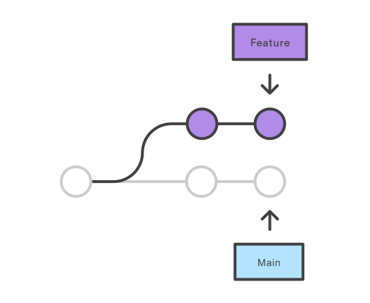

* Distributed Development: In SVN, each developer gets a working copy that points back to a single central repository. Git, however, is a distributed version control system. Instead of a working copy, each developer gets their own local repository, complete with a full history of commits.


And, similar to feature branches, distributed development creates a more reliable environment. Even if a developer obliterates their own repository, they can simply clone someone else’s and start anew.

* Pull Requests: Many source code management tools such as ***Github*** enhance core Git functionality with pull requests. A pull request is a way to ask another developer to merge one of your branches into their repository. This not only makes it easier for project leads to keep track of changes, but also lets developers initiate discussions around their work before integrating it with the rest of the codebase.


* Community: In many circles, Git has come to be the expected version control system for new projects. If your team is using Git, odds are you won’t have to train new hires on your workflow, because they’ll already be familiar with distributed development.

* Faster Release Cycle: The ultimate result of feature branches, distributed development, pull requests, and a stable community is a faster release cycle. These capabilities facilitate an agile workflow where developers are encouraged to share smaller changes more frequently.

### Git for marketing

To understand how switching to Git affects your company’s marketing activities, imagine your development team has three distinct changes scheduled for completion in the next few weeks:

The entire team is finishing up a game-changing feature that they’ve been working on for the last 6 months.
Mary is implementing a smaller, unrelated feature that only impacts existing customers.
Rick is making some much-needed updates to the user interface.

The shorter development cycle facilitated by Git makes it much easier to divide these into individual releases. This gives marketers more to talk about, more often. In the above scenario, marketing can build out three campaigns that revolve around each feature, and thus target very specific market segments.

For instance, they might prepare a big PR push for the game changing feature, a corporate blog post and newsletter blurb for Mary’s feature, and some guest posts about Rick’s underlying UX theory for sending to external design blogs. All of these activities can be synchronized with a separate release.

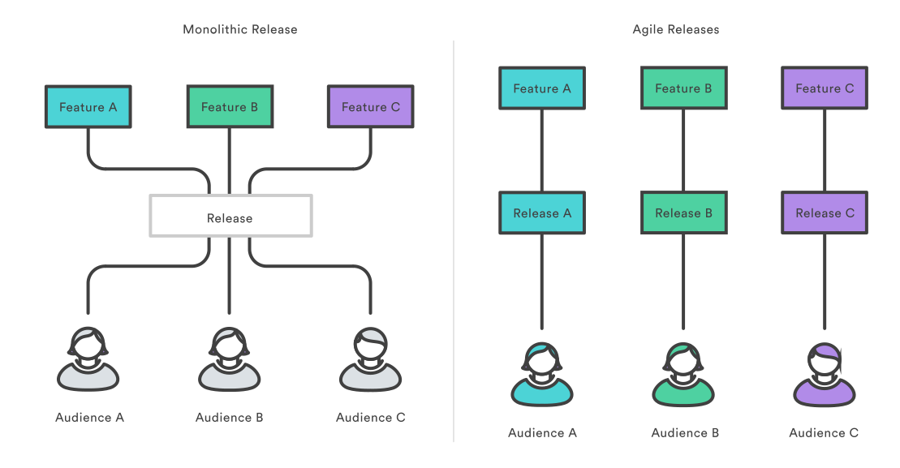

### Git for product management

The benefits of Git for product management is much the same as for marketing. More frequent releases means more frequent customer feedback and faster updates in reaction to that feedback. Instead of waiting for the next release 8 weeks from now, you can push a solution out to customers as quickly as your developers can write the code.

### Git for designers

The benefits of Git for product management is much the same as for marketing. More frequent releases means more frequent customer feedback and faster updates in reaction to that feedback. Instead of waiting for the next release 8 weeks from now, you can push a solution out to customers as quickly as your developers can write the code.

### Git for customer support

Customer support and customer success often have a different take on updates than product managers. When a customer calls them up, they’re usually experiencing some kind of problem. If that problem is caused by your company’s software, a bug fix needs to be pushed out as soon as possible.

Git’s streamlined development cycle avoids postponing bug fixes until the next monolithic release. A developer can patch the problem and push it directly to production. Faster fixes means happier customers and fewer repeat support tickets. Instead of being stuck with, “Sorry, we’ll get right on that” your customer support team can start responding with “We’ve already fixed it!

### Git for human resources

To a certain extent, your software development workflow determines who you hire. It always helps to hire engineers that are familiar with your technologies and workflows, but using Git also provides other advantages.

Employees are drawn to companies that provide career growth opportunities, and understanding how to leverage Git in both large and small organizations is a boon to any programmer. By choosing Git as your version control system, you’re making the decision to attract forward-looking developers.

### Git for anyone managing a budget

Being agile is all about finding out what works as quickly as possible, magnifying efforts that are successful, and eliminating ones that aren’t. Git serves as a multiplier for all your business activities by making sure every department is doing their job more efficiently.

## Install Git 
* [Install Git on Mac OS](#install-git-on-mac-os)
* [Install Git on Windows](#install-git-on-windows)
* [Install Git on Linux](#install-git-on-linux)

### Install Git on Mac OS 
1. Download the latest Git for [Mac installer](https://git-scm.com/download/mac).

2. Follow the prompts to install Git.

3. Open a terminal and verify the installation was successful by typing git --version:

```
$ git --version
git version 2.9.2
```

4. Configure your Git username and email using the following commands, replacing xyz's name with your own. These details will be associated with any commits that you create:

```
$ git config --global user.name "xyz"
$ git config --global user.email "xyz@swayaan.com"

```

### Install Git on Windows

1. Download the latest Git for [Windows installer](https://git-scm.com/download/win).

2. Follow the prompts to install Git.

3. Open a terminal and verify the installation was successful by typing git --version:

```
$ git --version
git version 2.39.2.windows.1
```


4. Configure your Git username and email using the following commands, replacing xyz's name with your own. These details will be associated with any commits that you create:

```
$ git config --global user.name "xyz"
$ git config --global user.email "xyz@swayaan.com"

```
### Install Git on Linux

1. Download the latest Git for [Linux installer](https://git-scm.com/download/linux).

2. Verify the installation was successful by typing git --version:

```
$ git --version
git version 2.39.2.windows.1
```


3. Configure your Git username and email using the following commands, replacing xyz's name with your own. These details will be associated with any commits that you create:

```
$ git config --global user.name "xyz"
$ git config --global user.email "xyz@swayaan.com"

```

## Git SSH
## Getting started - Create a initial project with Git (GitHub)

* Lets create a folder in our local machine. For ex: TodoApp
* Open cmd prompt and navigate to the folder created.
* Now to initialize your project, simply run [git init](#git-init).

### git init


This will tell Git to get ready to start watching your files for every change that occurs. It looks like this:


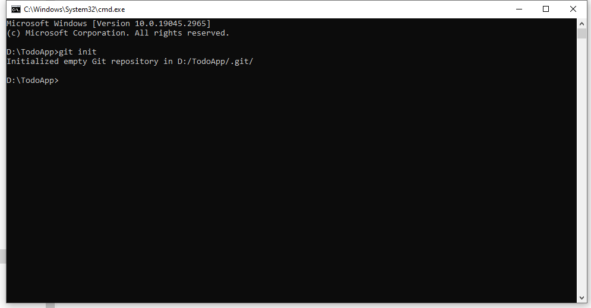

A response sent back telling me that my repository (repo) has been initialized. It is considered empty because we have not told Git what files to track.

A repository is just another way to define a project being watched/tracked by Git.

Before we proceed with learning other Git commands, let's talk about [GitHub](#github).

## GitHub
GitHub is an online hosting service for Git repositories. 

GitHub lets you store your repo on their platform. Another awesome feature that comes with GitHub is the ability to collaborate with other developers from any location.

### Create repository remotely in the GitHub

Now that we have created and initialized our project locally, let's create a simple file todo.txt and push it to GitHub.

* Go to the folder created. In my case d:/TodoApp
* create a file todo.txt 
* Add some content
* [Lets push the repository to git](#how-to-push-a-repository-to-github) 

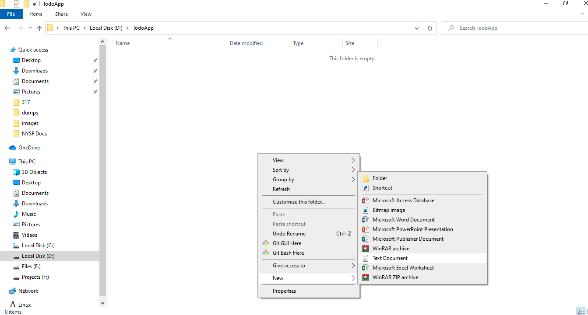

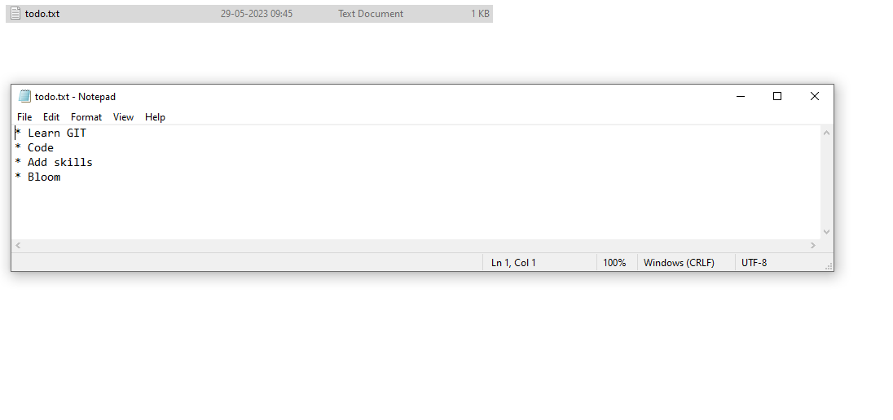

#### How to push a repository to GitHub

1.  **Create a GitHub account**:

        To be able to use GitHub, you will have to create an account first. You can do that on their [website](https://github.com/).

2. **Create a repository**:
        You can click on the + symbol on the top right corner of the page then choose "New repository". Give your repo a name then scroll down and click on "Create repository".

        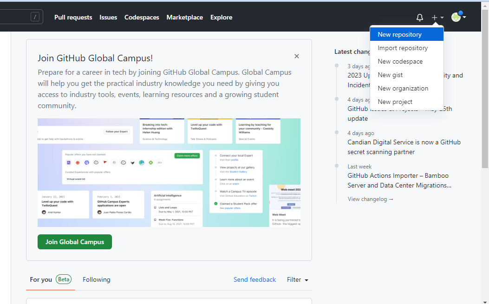

        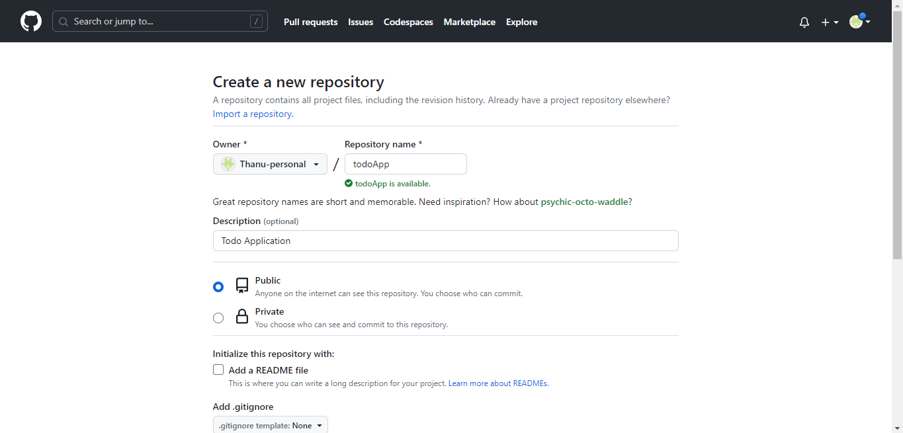

        Once you create a new repository, you will be redirceted to the below page.

        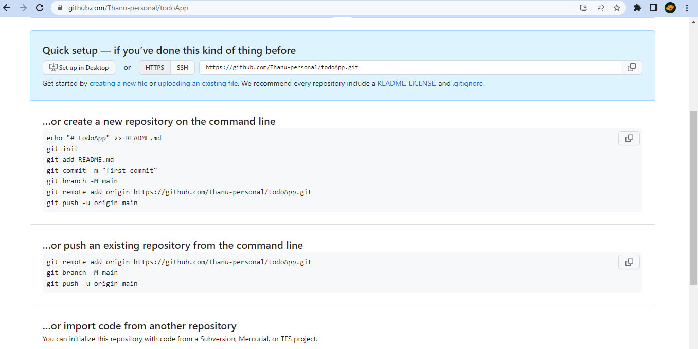


3. **Add and commit file(s)**:

        Before we "add" and "commit" our files, you need to understand the stages of a file being tracked by Git.

        **Committed state**
        A file is in the committed state when all the changes made to the file have been saved in the local repo. Files in the committed stage are files ready to be pushed to the remote repo (on GitHub).

        **Modified state**
        A file in the modified state has some changes made to it but it's not yet saved. This means that the state of the file has been altered from its previous state in the committed state.

        **Staged state**
        A file in the staged state means it is ready to be committed. In this state, all necessary changes have been made so the next step is to move the file to the commit state.

        To add and commit files to git, we use,

        * [git add](#git-add) command
        * [git status](#git-status) command
        * [git commit](#git-commit) command

4. [**Push the repository to GitHub**](#push-the-repository-to-github) 

##### git add

When we first initialized our project, the file was not being tracked by Git. To do that, we use this command **git add .** The period or dot that comes after add means all the files that exist in the repository. 

If you want to add a specific file, maybe one named todo.txt, you use the command **git add todo.txt**

To add a file to git, 

* Right click in the todoApp folder and open `git bash`

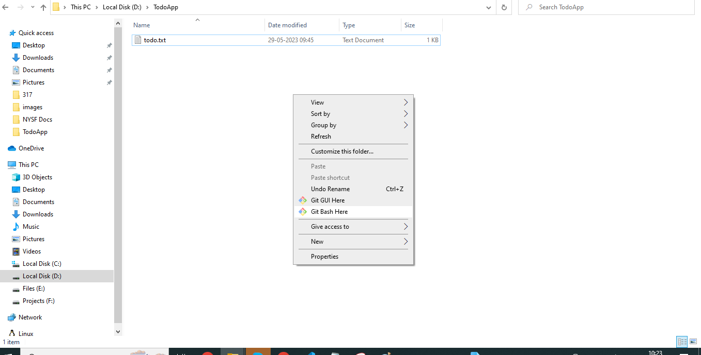

* Check the status of the files in the folder. use [git status](#git-status) command 
* Add the files to git, use command `git add todo.txt` 
* Again check the status. Now our file is in the staged state.
* The next state for a file after the staged state is the committed state. To commit our file, we use the [git commit](#git-commit) command.

##### git status

To check status, 

* Right click in the todoApp folder and open `git bash`


* Check the status of the files in the folder. use [git status](#git-status) command 

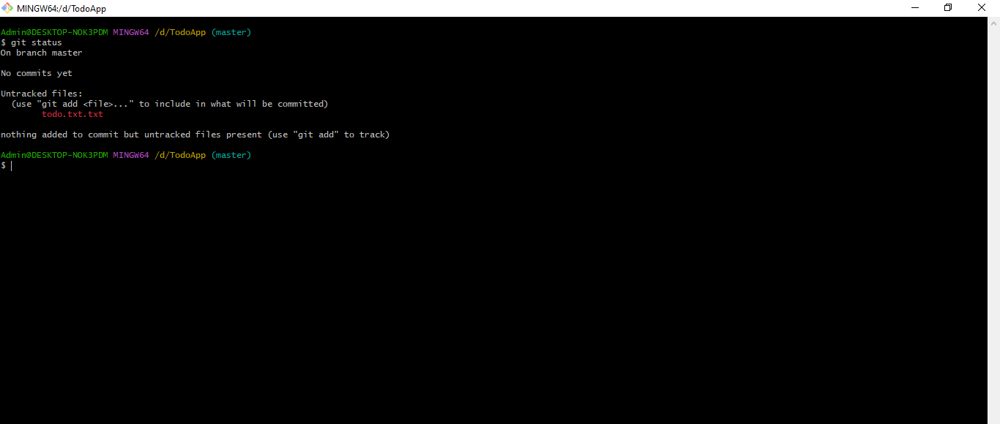

* <font color="red">Red </font> color says the file is in modified state 
* <font color="success">Green </font> color says the file is in staged state 


##### git commit 

 To commit our file, we use the git commit -m "first commit" command.

`git commit -m "relevent message for the commit" `

The first part of the command git commit tells Git that all the files staged are ready to be committed so it is time to take a snapshot. 

The second part -m "initial commit" is the commit message. -m is shorthand for message while the text inside the parenthesis is the commit message.

After executing this command, you should get a response similar to this:

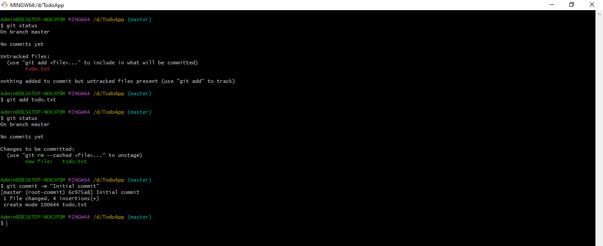

Now our file is in the committed state.


##### Push the repository to GitHub


We already have repository initialized. So lets concentrate on **…or push an existing repository from the command line** section


These are the commands:

```
git remote add origin https://github.com/Thanu-personal/todoApp.git
git branch -M main
git push -u origin main

```

> The first command git remote add origin https://github.com/Thanu-personal/todoApp.git creates a connection between your local repo and the remote repo on Github.

> The second command git branch -M main changes your main branch's name to "main". The default branch might be created as "master", but "main" is the standard name for this repo now. There is usually no response here.

> The last command git push -u origin main pushes your repo from your local device to GitHub. You should get a response similar to this:

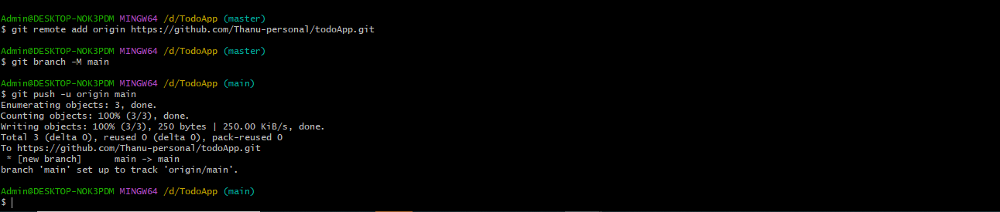


### How to Pull a Repository in Git (git clone)


To pull in Git means to clone a remote repository's current state into your computer/repository. 

This comes in handy when you want to work on your repo from a different computer or when you are contributing to an open source project online.

[Go to GitHub](https://github.com/vijaynvb/todoapi), and on your repository's main page you should see a green button that says "Code". When you click on the button, you should see some options in a dropdown menu. Go on and copy the HTTPS URL.

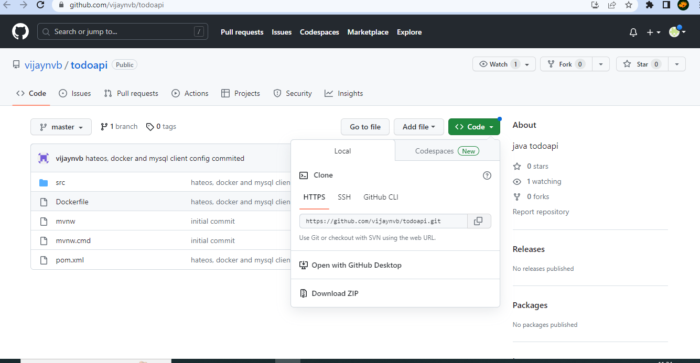

After that, run git clone YOUR_HTTPS_URL. This command pulls the remote repository into your local computer in a folder called todoJavaApp. 

`git clone YOUR_HTTPS_URL`

`git clone https://github.com/vijaynvb/todoapi.git`

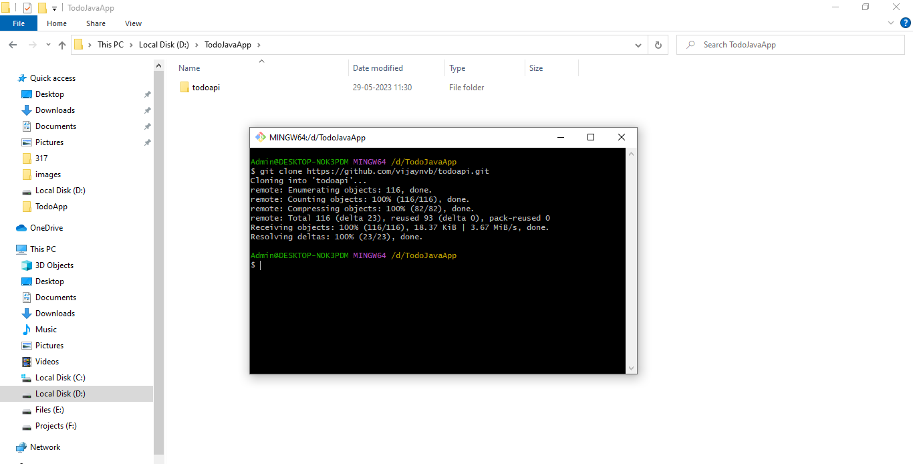

### How to Push a Repository in Git (git push)

To push a local branch to remote repository 

```
git push -u origin `Your_Banch_Name`
```

```
git push -u origin testApp
```
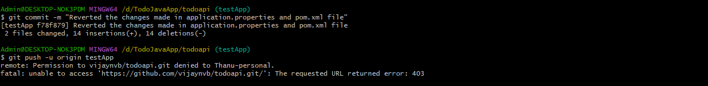

Output above says, you are not allowed to push the branch to remote. Go to github remote repository and update the permisssions.

If you are permitted to push to remote, you should be able to see the screen like this in your gitHub account


### How to Use Branches in Git

With branches, you can create a copy of a file you would like to work on without messing up the original copy. You can either merge these changes to the original copy or just let the branch remain independent.

Before we go into using branches, visual representation of our repo which looks like this:

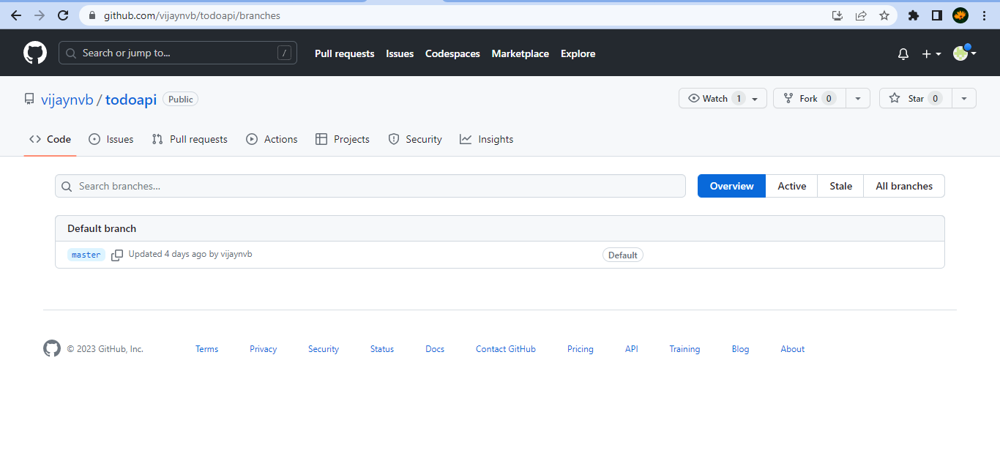

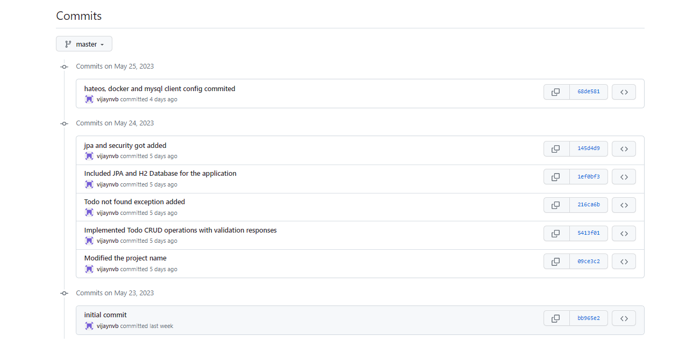

The images above shows our master branch with the last 7 commits.

You can checkout to the any intermediate branch & continue working or you can also create a new branch.

To list out all the branches in the repository, we use the command, [git branch](#git-branch)

Lets create a new branch called `testApp` to see what my App would look like with more tasks included.

To create a new branch, we use [git checkout](#git-checkout) command

#### git checkout 

To create a new branch, run this command: 

``` 
git checkout -b testApp

```

> checkout tells Git it is supposed to switch to a new branch. -b tells Git to create a new branch. testApp is the name of the branch to be created and switched to. Here is the response you should get:


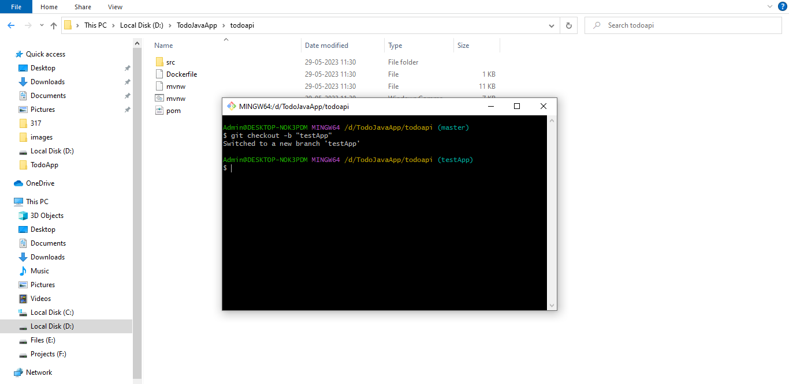

#### git branch 

To list out the local branches in the repository, we use

```
git branch 
```

To list out the local branches in the repository, we use

```
git branch -r 
```

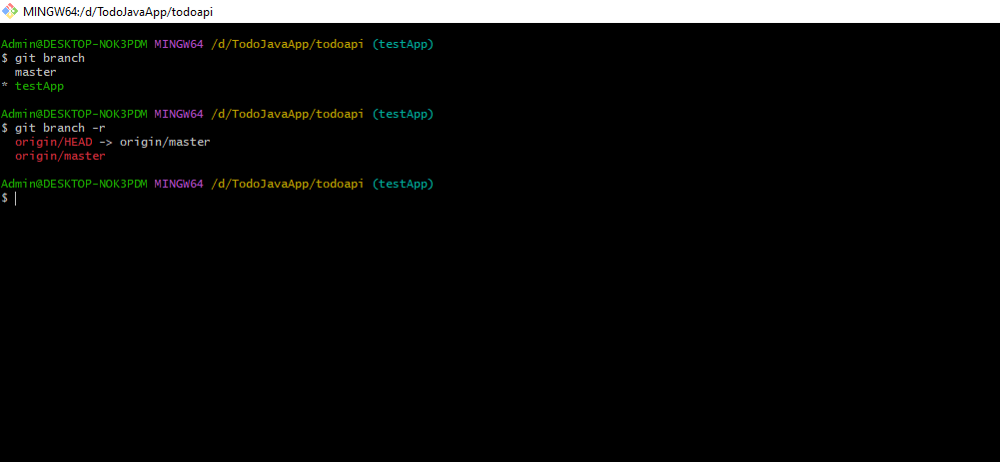

Now let us make some changes in the new branch.

##### Example (Hands on)

Open the project in sts, modify the ***pom.xml*** and ***application.properties*** so that we can work on h2 database.

Task:

1. **pom.xml** : Commented the dependency on sql connector and uncommenting h2 database dependency
2. **application.properties** : Commented mysql properties and uncommented h2 properties

Run & test the application. If all your changes are working properly. You can now commit the changes. 

**Try doing it by yourself**

The commands to execute:

```
git status - Your modified files should be listed
git add - Add all the files 
git commit -m "Relevent message" 
```

#### git merge 

git merge merges the changes of one branch to another branch. 

You can merge the branches locally or you can also push the new branch to remote and raise the merge request.
So that all the code pushed by the developers are merged remotely on the git. 

1. [git merge locally](#git-merge-locally)

2. [git merge remotely](#git-merge-remotely)

#### git merge locally

Lets merge the changes we made in the testApp branch into the master branch by running git merge testApp. You will see all the changes made in the testApp branch reflected on the main branch. You should also receive a response similar to this:

After committing your testApp branch, switch back to the master branch by running this command: 

```
git checkout master
```

Observe that there is no -b. This is because we are not creating a new branch but rather switching to an existing one.

```
git merge testApp
```

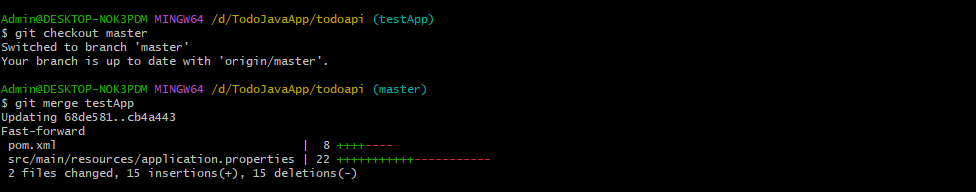


#### git merge remotely

Lets merge the changes we made in the testApp branch into the master branch remotely. 

After committing your testApp branch, push the branch to remote repository and raise the merge request 

Follow the steps:

1. Push the branch to remote repository 
2. Raise merge request 


